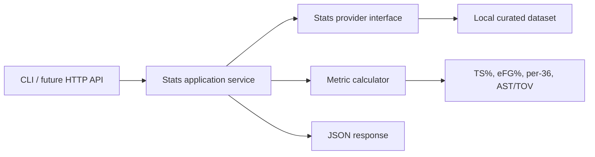

# NBA Statline Service

Backend showcase service for NBA statistics, player efficiency analysis, team pace, and leaderboard-style API responses.

The project is built as a compact, reviewable backend service: deterministic sample data, provider abstraction for future live APIs, analytics layer, CLI output, PHPUnit tests, and CI. It is designed to demonstrate Senior Backend thinking without requiring private commercial code.

## What It Shows

- Domain modelling for teams, players, and game stat lines.
- Basketball analytics metrics: true shooting percentage, effective field goal percentage, usage proxy, points per 36 minutes, assist-to-turnover ratio.
- Provider abstraction: local dataset now, live NBA/stat provider later.
- Application service layer for leaderboards and team summaries.
- Cache-ready architecture: expensive analytics can be memoized without changing domain code.
- Machine-readable CLI output for dashboards, bots, or API wrappers.
- PHPUnit tests and GitHub Actions CI.

## Quick Start

```bash
composer install
composer test

php bin/statline leaders points
php bin/statline leaders true-shooting
php bin/statline team DEN
php bin/statline export
```

## Example Output

```json
{
  "metric": "true-shooting",
  "leaders": [
    {
      "player": "Nikola Jokic",
      "team": "DEN",
      "value": 70.1,
      "minutes": 34.2
    }
  ]
}
```

## Architecture



## Project Structure

```text
bin/statline
src/
  Application/
    LeaderboardService.php
    TeamSummaryService.php
  Domain/
    Player.php
    Team.php
    StatLine.php
    PlayerMetric.php
  Infrastructure/
    LocalNbaStatsProvider.php
    NbaStatsProvider.php
  Analytics/
    MetricCalculator.php
  Support/
    JsonResponse.php
tests/
  LeaderboardServiceTest.php
  TeamSummaryServiceTest.php
docs/
  architecture.md
  api.md
```

## Implementation Notes

The current implementation intentionally uses a local curated dataset instead of scraping a live sports API. That makes tests deterministic and keeps the project easy to review. A production version would add:

- scheduled ingestion job;
- Redis cache for leaderboards;
- provider adapter for a paid sports data API;
- HTTP API layer with rate limiting;
- OpenAPI schema;
- queue-based refresh workflow;
- observability around ingestion freshness and provider failures.

## Example API Shape

The CLI mirrors the intended HTTP API:

```http
GET /api/leaders?metric=true-shooting
GET /api/teams/DEN/summary
GET /api/export
```

## Why This Is A Good Portfolio Project

Sports analytics is familiar, but still technical enough to show backend quality:

- non-trivial domain rules;
- calculated metrics;
- sorting and ranking;
- data-source abstraction;
- deterministic tests;
- clear documentation;
- simple path to a real API product.

## Related Site

Resume/portfolio page:

[https://inotmustdie.github.io](https://inotmustdie.github.io)
