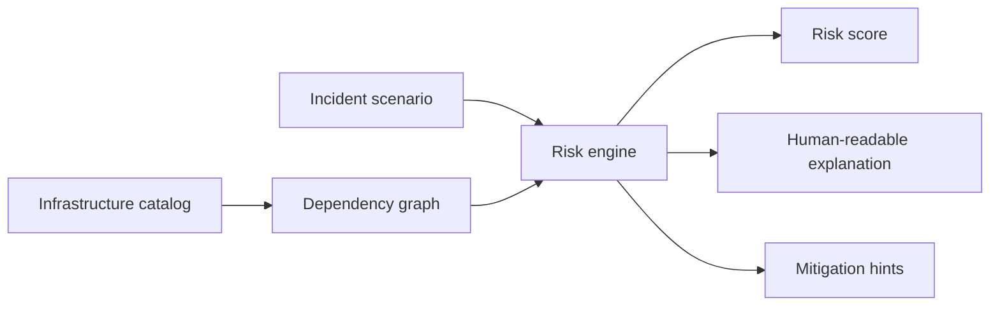

# Internet Pulse Engine

Risk engine for modelling the critical dependency layers that keep the public internet alive: DNS roots, BGP transit, IXPs, cloud regions, CDNs, certificate authorities, time synchronization, and major submarine cable corridors.

This is a compact portfolio project for Senior Backend roles. It is intentionally small enough to review quickly, but it demonstrates the kind of thinking that matters in production systems: domain modelling, dependency graphs, scenario simulation, risk scoring, clear trade-offs, tests, and CI.

## Why This Project Is Interesting

Most applications depend on infrastructure they do not control. A product can have perfect code and still degrade if DNS, routing, certificates, cloud regions, or edge networks fail.

This project models those dependencies and answers questions such as:

- Which layer is the current bottleneck?
- What happens if a DNS root cluster, IXP, CDN, or cloud region degrades?
- Which nodes are high impact but low redundancy?
- How should an incident summary be explained to non-infrastructure stakeholders?

## Architecture



## Domain Layers

- **Name resolution:** DNS root servers, recursive DNS, TLD registries.
- **Routing:** BGP transit providers, route collectors, major IXPs.
- **Edge delivery:** CDNs, WAF/edge networks, Anycast footprints.
- **Compute platforms:** cloud regions and multi-region failover assumptions.
- **Trust:** certificate authorities, OCSP/CRL availability, CT logs.
- **Time:** NTP/PTP sources and clock drift risk.
- **Physical layer:** submarine cable corridors and landing stations.

## Key Trade-offs

### Static catalogue instead of live scraping

**Decision:** keep the base infrastructure catalogue as versioned data.  
**Why:** live scraping is noisy and brittle; a portfolio project should make the model reviewable.  
**Trade-off:** data freshness depends on commits, but tests and diffs make changes auditable.

### Weighted risk scoring instead of binary uptime

**Decision:** each node carries impact, redundancy, blast radius, and confidence.  
**Why:** real infrastructure rarely has a clean up/down state. A degraded DNS or routing layer can be more important than a fully down minor service.  
**Trade-off:** scoring is approximate, but explainable.

### Explainable output over black-box scoring

**Decision:** every score includes reasons and mitigation hints.  
**Why:** incident tooling is only useful if humans can act on it during pressure.  
**Trade-off:** more verbose model code, but better operational value.

## Quick Start

```bash
composer install
composer test
php bin/pulse scenario dns-root-degradation
php bin/pulse scenario cloud-region-loss
php bin/pulse export
```

## Example Output

```json
{
  "scenario": "dns-root-degradation",
  "risk_score": 82,
  "severity": "high",
  "most_affected_layers": ["name-resolution", "edge-delivery"],
  "summary": "Root DNS degradation raises global lookup latency and increases dependency on recursive resolver cache behaviour.",
  "recommended_actions": [
    "verify authoritative DNS redundancy",
    "check recursive resolver failover",
    "lower operational dependency on synchronous DNS lookups"
  ]
}
```

## Project Structure

```text
bin/pulse
src/
  Catalog/InternetCatalog.php
  Domain/InfrastructureNode.php
  Domain/IncidentScenario.php
  Domain/RiskAssessment.php
  Engine/RiskEngine.php
  Support/JsonResponse.php
tests/
  RiskEngineTest.php
docs/
  architecture.md
  scenarios.md
```

## Quality Signals

- PHP 8.2+ with strict types.
- Domain objects are immutable.
- Risk engine is deterministic and testable.
- CLI exposes machine-readable JSON.
- CI runs tests on push and pull requests.
- Documentation explains architectural trade-offs, not just setup commands.

## Related Demo

The GitHub Pages dashboard lives at:

[https://inotmustdie.github.io](https://inotmustdie.github.io)

It presents a simple visual layer on top of the same concept: a planetary view of the critical infrastructure layers behind the public internet.
