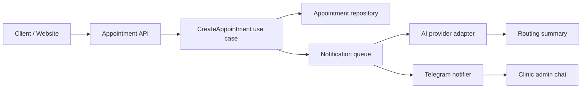

# CareOps AI Assistant API

Backend showcase project for a healthcare appointment workflow with AI-assisted routing, Telegram notifications, and asynchronous processing.

This repository is intentionally compact: it is not a full production clone, but a readable technical portfolio project that demonstrates backend architecture decisions relevant to Senior PHP/Laravel roles.

## Why This Project Exists

Commercial healthcare and CRM projects are usually closed-source, so this repository shows the same kind of engineering decisions in a safe demo domain:

- API-first appointment workflow;
- queue-based notification delivery;
- AI provider abstraction for OpenAI/Anthropic-style assistants;
- Telegram integration boundary;
- explicit architecture trade-offs;
- tests around critical business logic;
- CI pipeline example.

## Tech Stack

- PHP 8.2+
- Laravel-oriented architecture
- PostgreSQL/MySQL-ready persistence model
- Redis-style queue workflow
- Telegram Bot API integration boundary
- OpenAI/Anthropic provider abstraction
- Pest/PHPUnit-style tests
- GitHub Actions CI example

## Domain Scenario

A patient wants to book a clinic appointment. The backend should:

1. Validate appointment request data.
2. Match the request with a specialist/service context.
3. Create an appointment draft.
4. Ask an AI assistant to prepare a short routing summary.
5. Dispatch async notifications instead of blocking the user-facing request.
6. Send Telegram confirmation to admins or operators.

## Architecture



## Key Trade-offs

### Queue notifications instead of synchronous delivery

**Problem:** Telegram and AI calls can be slow or temporarily unavailable.  
**Decision:** The appointment request stores the business event first and sends notifications asynchronously.  
**Trade-off:** The user receives a fast response, while notification delivery becomes eventually consistent.  
**Why it matters:** This protects p95 API latency and avoids losing appointments because an external integration is down.

### Provider abstraction for AI

**Problem:** AI vendors differ in request formats, pricing, latency, and failure modes.  
**Decision:** Keep a small `AiRoutingProvider` interface and separate provider implementations.  
**Trade-off:** Slightly more code upfront, but easier migration between OpenAI, Anthropic, or an internal model.  
**Why it matters:** Business logic should not depend directly on a single vendor SDK.

### Explicit use case layer

**Problem:** Putting validation, persistence, AI routing, and notification dispatch inside one controller makes changes risky.  
**Decision:** Controllers stay thin; orchestration lives in `CreateAppointment`.  
**Trade-off:** More files, but better testability and clearer ownership of business flow.  
**Why it matters:** Senior-level backend work is mostly about keeping change cost low as product complexity grows.

## Example API

### Create appointment

```http
POST /api/appointments
Content-Type: application/json
```

```json
{
  "patient_name": "Ivan Petrov",
  "phone": "+79990000000",
  "service": "Psychotherapy consultation",
  "preferred_date": "2026-06-15",
  "comment": "Need an evening slot"
}
```

### Response

```json
{
  "id": "apt_1024",
  "status": "pending_confirmation",
  "message": "Appointment request accepted"
}
```

## Project Structure

```text
app/
  Domain/Appointments/
    Appointment.php
    AppointmentStatus.php
  Application/Appointments/
    CreateAppointment.php
    CreateAppointmentData.php
  Infrastructure/
    Ai/AiRoutingProvider.php
    Ai/FakeAiRoutingProvider.php
    Notifications/TelegramNotifier.php
tests/
  Feature/CreateAppointmentTest.php
.github/workflows/ci.yml
```

## Quality Signals

- Thin controllers, explicit use cases.
- External integrations behind interfaces.
- Queue-friendly notification workflow.
- Tests focused on business behavior.
- CI pipeline with dependency install, static checks placeholder, and tests.
- Architecture notes explain why decisions were made, not only what code exists.

## Local Setup

This showcase is intentionally lightweight and can be run as a standalone PHP project for tests, or copied into a Laravel 12 application as a reference implementation.

Standalone setup:

```bash
composer install
composer test
```

Recommended full Laravel adaptation:

```bash
composer create-project laravel/laravel careops-ai-assistant-api
cd careops-ai-assistant-api
composer require pestphp/pest pestphp/pest-plugin-laravel --dev
```

Then copy the `app/`, `tests/`, and `.github/` folders from this repository.

## CI

The included GitHub Actions workflow demonstrates a typical backend CI shape:

- install PHP dependencies;
- run tests;
- keep a placeholder for static analysis or linting.

## Notes

This project deliberately avoids real patient data and production secrets. Any real integration credentials should be configured through environment variables and never committed.
